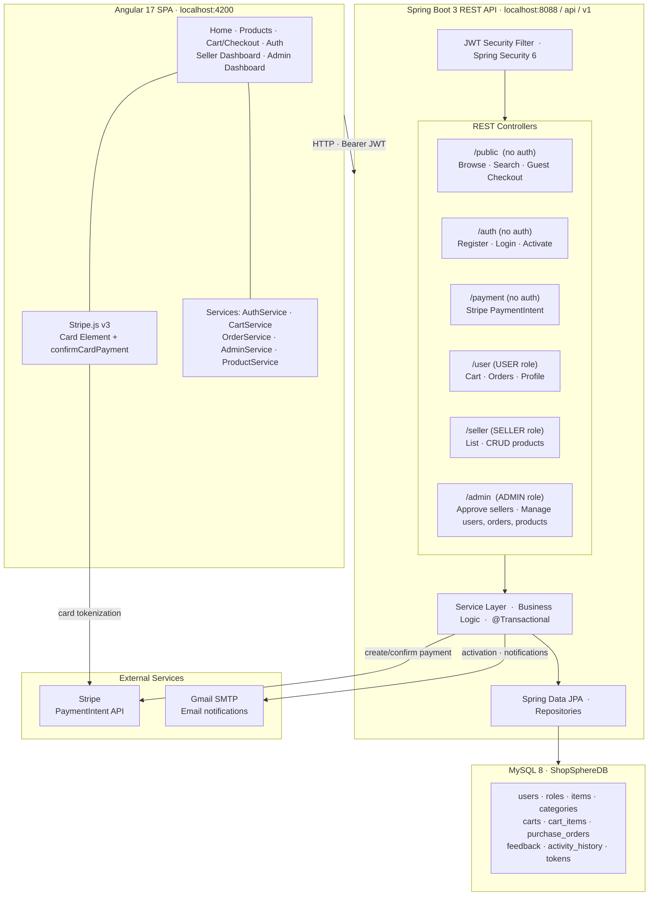

# ShopSphere 🛒

A full-stack multi-seller e-commerce platform I built to practice real-world backend + frontend integration. It covers the full lifecycle of an online marketplace : buyer browsing, seller storefronts, Stripe payments, email activation, and a complete admin dashboard.

[](https://openjdk.org/)
[](https://spring.io/projects/spring-boot)
[](https://angular.io/)
[](https://www.mysql.com/)
[](https://stripe.com/)
[](LICENSE)

---

## What is this?

ShopSphere is a marketplace where three types of users interact:

- **Buyers** : browse 18 product categories, add to cart, and checkout with Stripe. No account required.
- **Sellers** : register, get approved by an admin, then manage their own product listings.
- **Admins** : oversee everything from a 5-tab dashboard: users, sellers, orders, products, and platform stats.

The whole point was to build something non-trivial : real JWT auth, real Stripe PaymentIntent flow, role-based access, email activation, and a proper admin panel that actually makes sense for a marketplace.

---

## System Architecture



---

## Features

| | Feature | How it works |
|-|---------|--------------|
 | **Guest checkout** | Cart lives in localStorage, no login required. Stripe handles payment. |
 | **Stripe payments** | PaymentIntent API : card data never touches my server (PCI-compliant) |
 | **JWT auth** | Access + refresh tokens, email activation link on register |
 | **Seller workflow** | Register → activate email → wait for admin approval → start selling |
 | **Admin dashboard** | 5 tabs: platform stats, orders, products, seller approvals, user management |
 | **Order tracking** | Full lifecycle: Pending → Confirmed → Shipped → Delivered → Cancelled |
 | **Product reviews** | Star ratings + text comments, average shown on product pages |
 | **Cart merge** | Guest cart automatically merges into account cart on login |
 | **Email notifications** | Activation links and order confirmations via Gmail SMTP |
 | **Swagger UI** | Full interactive API docs at `/swagger-ui.html` |

---

## Tech Stack

**Backend**
- Java 17, Spring Boot 3.3.2
- Spring Security 6 with JWT (stateless, filter-based)
- Spring Data JPA + Hibernate + MySQL 8
- Stripe Java SDK for payment processing
- Spring Mail → Gmail SMTP
- Lombok, Jackson, Docker Compose

**Frontend**
- Angular 17 with standalone components and lazy loading
- Angular Signals for reactive state (no NgRx)
- Tailwind CSS v3
- Stripe.js v3 Card Element
- RxJS + HttpClient with a JWT interceptor

---

## Running it locally

### You'll need
- Java 17+, Maven
- Node.js 18+, npm
- Docker Desktop (handles MySQL and mail server)
- A Stripe account (test mode is completely free)
- A Gmail account with an App Password

### 1. Clone and set up environment

```bash
git clone https://github.com/yosr-fourati/ShopSphere.git
cd ShopSphere/TunisiCart
cp .env.example .env
```

Fill in your `.env`:

```properties
DB_URL=jdbc:mysql://localhost:3307/ShopSphereDB
DB_USERNAME=your_db_user
DB_PASSWORD=your_db_password

MAIL_USERNAME=your_gmail@gmail.com
MAIL_PASSWORD=your_16_char_app_password

STRIPE_SECRET_KEY=sk_test_...
STRIPE_PUBLISHABLE_KEY=pk_test_...

JWT_SECRET=any_32_plus_char_hex_string
```

### 2. Start Docker services

```bash
docker compose up -d
```

This starts MySQL 8 on port `3307` and MailDev (email preview UI) on port `1080`.

### 3. Start the backend

```bash
./mvnw spring-boot:run
```

API is at `http://localhost:8088/api/v1` : the database and demo data seed automatically on first run.

### 4. Add your Stripe key to the frontend

Edit `shopsphere-frontend/src/environments/environment.ts`:
```typescript
export const environment = {
  production: false,
  apiUrl: 'http://localhost:8088/api/v1',
  stripePublishableKey: 'pk_test_YOUR_KEY_HERE',
};
```

### 5. Start the frontend

```bash
cd shopsphere-frontend
npm install
npm start
```

Open **http://localhost:4200** , you should see the ShopSphere homepage with products loaded.

---

## Test accounts

These are auto-created on every startup:

| Role | Email | Password |
|------|-------|----------|
|  Admin | `admin@shopsphere.com` | `Sph3re@Adm!n#2025` |
|  Seller | `seller@shopsphere.com` | `Seller1234!` |
|  Buyer | `buyer@shopsphere.com` | `Buyer1234!` |

---

## Stripe test cards

| Result | Card number |
|--------|------------|
| Success | `4242 4242 4242 4242` |
| Declined | `4000 0000 0000 0002` |
| 3D Secure | `4000 0025 0000 3155` |

Use any future expiry, any CVC, any zip code.

---

## How checkout works

**As a guest:**
```
Browse → Add to cart (localStorage) → Checkout
→ Enter name, email, address
→ Stripe card form appears
→ Pay → order confirmed + confirmation email sent
```

**As a logged-in buyer:**
```
Login → Browse → Add to cart (database)
→ Place order → Stripe card form
→ Pay → order saved to your history
```

---

## Admin Dashboard

Log in as admin and go to `/admin`.

| Tab | What you can do |
|-----|----------------|
| **Overview** | See platform GMV (total seller sales), active sellers, order count, product count, order status breakdown |
| **Orders** | View every order, change status with a dropdown |
| **Products** | Browse all listed products, delete any listing |
| **Sellers** | Approve or reject seller applications |
| **Users** | View all users, delete accounts (handles all FK dependencies cleanly) |

---

## API Reference

```
PUBLIC  (no auth required)
  GET  /public/items                    Browse products with search + filter + pagination
  GET  /public/items/{id}               Single product detail
  GET  /public/categories               All 18 categories
  GET  /public/sellers                  Approved sellers
  POST /public/orders                   Place a guest order

AUTH  (no auth required)
  POST /auth/register                   Sign up (USER or SELLER role)
  POST /auth/authenticate               Login → accessToken + refreshToken
  GET  /auth/activate-account?token=    Activate account from email link

PAYMENT  (no auth required)
  POST /payment/create-payment-intent   Creates Stripe PaymentIntent, returns clientSecret

USER  (requires login, USER role)
  GET    /user/cart/{userId}            Fetch cart
  POST   /user/cart/{userId}/items      Add to cart
  PUT    /user/cart/{cartItemId}        Update quantity
  DELETE /user/cart/{cartItemId}        Remove item
  POST   /user/orders                   Place order
  GET    /user/orders/history/{userId}  Order history

SELLER  (requires login, SELLER role)
  GET    /seller/items                  My listings
  POST   /seller/items                  Add listing
  PUT    /seller/items/{id}             Edit listing
  DELETE /seller/items/{id}             Remove listing
  GET    /seller/orders                 Orders with my products

ADMIN  (requires login, ADMIN role)
  GET    /admin/stats                   Platform stats (GMV, users, sellers, products)
  GET    /admin/users                   All users
  DELETE /admin/users/{id}              Delete user + all related data
  GET    /admin/sellers/pending         Pending applications
  PUT    /admin/sellers/{id}/approve    Approve seller
  PUT    /admin/sellers/{id}/reject     Reject seller
  GET    /admin/orders                  All orders
  PUT    /admin/orders/{id}/status      Update order status
  GET    /admin/items                   All products (paginated)
  DELETE /admin/items/{id}              Delete a product
```

---

## Gmail App Password setup

1. Use or create a Gmail account for sending emails
2. Go to **Google Account → Security → 2-Step Verification** (enable it)
3. Then go to **Security → App Passwords** → create one for "Mail"
4. Copy the 16-character password into `.env` as `MAIL_PASSWORD`

---

## Project structure

```
TunisiCart/                                   Spring Boot backend
├── src/main/java/com/AeiselDev/ShopSphere/
│   ├── Configs/       DataSeeder, CORS, OpenAPI, Security config
│   ├── controllers/   REST endpoints
│   ├── services/      Business logic
│   ├── entities/      JPA entities
│   ├── repositories/  Spring Data JPA repos
│   ├── security/      JWT filter + service
│   └── enums/         RoleType, DeliveryStatus
└── src/main/resources/application.yml

shopsphere-frontend/                          Angular 17 SPA
└── src/app/
    ├── core/
    │   ├── services/     auth, cart, order, admin, product
    │   ├── guards/       auth, seller, admin, guest
    │   └── interceptors/ JWT header injection
    └── features/
        ├── home/         Landing page
        ├── products/     List + detail
        ├── cart/         Cart + Stripe checkout
        ├── orders/       Order history
        ├── auth/         Login / register / activate
        ├── seller/       Seller dashboard
        └── admin/        Admin dashboard (5 tabs)
```

---

## Author

**Yosr Fourati** : MS Software Engineering · Oakland University · 2026
[GitHub](https://github.com/yosr-fourati)

---

MIT © 2024–2026 Yosr Fourati
